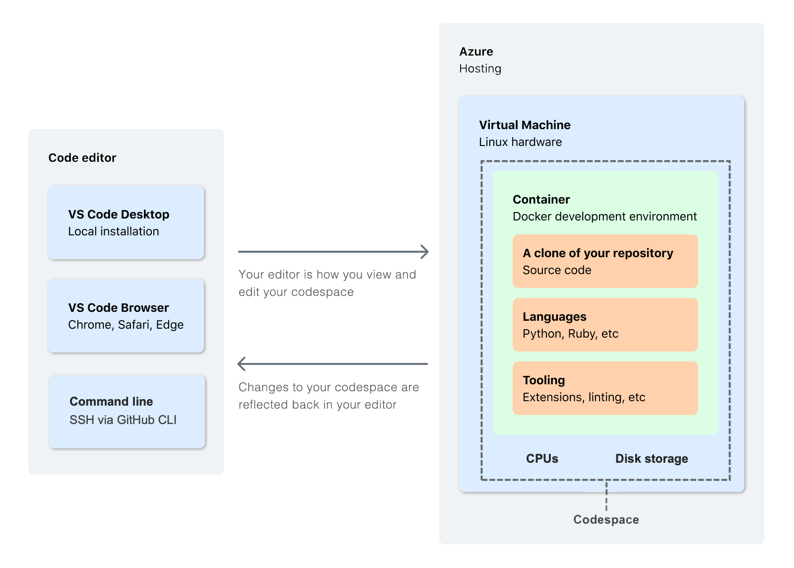

# # GitHub Codespaces

### **What is GitHub Codespaces**

> A codespace is a development environment that's hosted in the cloud
>
> By default, the codespace development environment is created from an **Ubuntu Linux** image that includes a selection of popular languages and tools, but you can use an image based on a Linux distribution of your choice and configure it for your particular requirements. Regardless of your local operating system, your codespace will run in a Linux environment



### Using GitHub Codespaces

To begin developing using cloud-based compute resources, you can create a codespace from a template or from any branch or commit in a repository. When you create a codespace from a template, you can start from a blank template or choose a template suitable for the work you're doing.

To get started with GitHub Codespaces, see [Quickstart for GitHub Codespaces](https://docs.github.com/en/codespaces/quickstart). For more information on creating a codespace, see [Creating a codespace for a repository](https://docs.github.com/en/codespaces/developing-in-codespaces/creating-a-codespace-for-a-repository) or [Creating a codespace from a template](https://docs.github.com/en/codespaces/developing-in-codespaces/creating-a-codespace-from-a-template). If you want to return to a codespace you've already created, see [Opening an existing codespace](https://docs.github.com/en/codespaces/developing-in-codespaces/opening-an-existing-codespace). To learn more about how GitHub Codespaces works, see [Deep dive into GitHub Codespaces](https://docs.github.com/en/codespaces/about-codespaces/deep-dive).

# Using Conda in Codespaces

### What is Conda

> Conda is a free and open-source package management system and environment management system. It is used to install, manage, and distribute software packages, particularly for Python and R, but it can also handle other languages like C, C++, FORTRAN, Java, Scala, Ruby, and Lua.
>
> Conda is known for its ability to create isolated environments, which helps prevent conflicts between different versions of packages or different projects.

1. Verify **conda** is installed 

```
conda --version
```

or 

```
conda info
```

2. Then try

```
conda init
```

```
source ~/.bashrc
```

You should see that **base** is activated. This will help auto manage your kernels and make them available 

```
conda install -c conda-forge nb_conda_kernels
```

Then create a new environment 

```
conda create -n yourenvname
```

```
conda activate yourenvname
conda install ipykernel
python -m ipykernel install --user --name yourenvname --display-name "A NAME TO DISPLAY"
```

