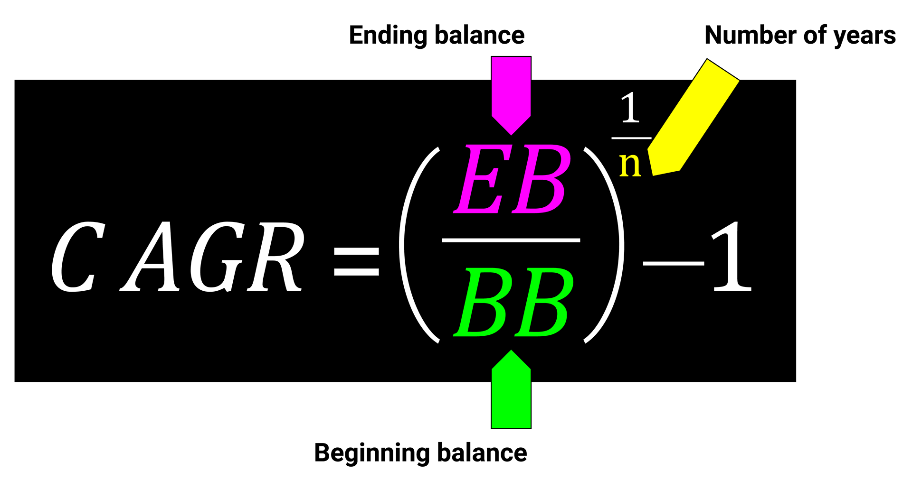

## Finally Functioning

In this activity, you will define a function to calculate compound annual growth rate (CAGR) for an investment portfolio. You are encouraged to work with a partner on this activity.

## Background

You have been working with Harold and Sam after hours to further develop your FinTech skills and automate your day jobs.

While fine-tuning your algorithms, you realize that you've written the logic to calculate compound annual growth rate three times: once for 2016, once for 2017, and once for 2018. You're annoyed that you've reinvented the wheel each time, and you're growing concerned that if you make any changes to the algorithm, you'll have to make changes in three different places.

This cannot be maintained. You decide to refactor all of your code to make it as modular and reusable as possible.

In this activity, define a function named `calculate_compound_growth_rate` that will accept three arguments:

* `beginning_balance`

* `ending_balance`

* `years`

The function should output a float as `growth_rate`.

Modularize this code so that you can dynamically calculate compound annual growth rate (CAGR) by simply calling a function with the required inputs. The results will indicate how you've been functioning as a trader.

CAGR is valuable, as it calculates and predicts growth rate earnings and percent increase or decrease of a stock, portfolio, or bank account. This will be useful when trying to evaluate portfolio/stock performance or when choosing which savings account might produce the most return.

Compound annual growth rate formula:

## Instructions

Use the `Unsolved/finally_functioning.py` to complete the following steps:

1. Define a function `calculate_compound_growth_rate` that takes in `beginning_balance`, `ending_balance`, and `years` as input. Output `growth_rate`.

2. Initialize `beginning_balance` to 29000.00.

3. Initialize `ending_balance` to 45000.00.

4. Initialize `years` to 1.0.

5. Call `calculate_compound_growth_rate()` and use the above values (found in Steps 3-5) to calculate and capture the result as `year_one_growth`.

6. Update `beginning_balance` to 45000.00.

7. Update `ending_balance` to 47000.00.

8. Call `calculate_compound_growth_rate()` and capture results as `year_two_growth`.

9. Update `beginning_balance` to 47000.00.

10. Update `ending_balance` to 48930.00.

11. Call `calculate_compound_growth_rate()` and capture results as `year_three_growth`.

12. Use the Python `round()` function to round `year_one_growth`, `year_two_growth`, and `year_three_growth`. Capture these new values as new variables.

13. Use string formatting to print `year_one_growth`, `year_two_growth`, and `year_three_growth` as percents.

14. Quickly review the values printed on the screen, and identify the year with the highest rate of return.

## Challenge

Instead of saving the `year_one_growth`, `year_two_growth`, and `year_three_growth` values in variables, add `growth_rate` to a global list named `growth_rates`.

Then, write this logic in a new function `calculate_compound_growth_rate_list`.

## Hints

* Instead of returning the local `growth_rate` variable, store it in the `growth_rates` global list object.

* Refer to the [W3Schools documentation](https://www.w3schools.com/python/ref_func_round.asp) for the Python round function.

